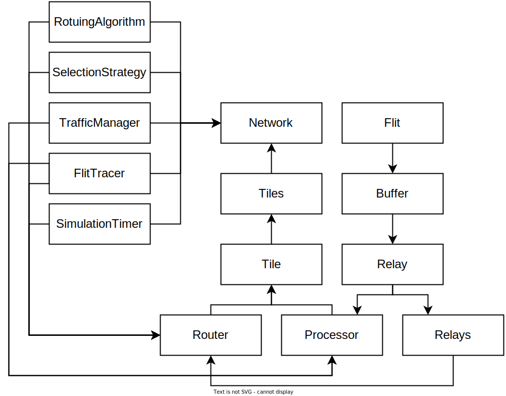

# Sumulator core structure




[```Network```](../class_description/hardware/network.md)
class acts as a container for network components. 
[```Network```](../class_description/hardware/network.md)
consists of tiles, each of them is represented as pair of Processor and Router.<br> 
[```Processor```](../class_description/hardware/processor.md)
class is responsible for generating network traffic and connected with 
[```Router```](../class_description/hardware/router.md)
through local 
[```Relay```](../class_description/hardware/relay.md). 
[```Processor```](../class_description/hardware/processor.md)
is using 
[```TrafficManager```](../class_description/configuration/traffic_manager.md)
for decisions on packet production per each cycle.<br>
[```Router```](../class_description/hardware/router.md)
class have an array of 
[```Relay```](../class_description/hardware/relay.md)s, 
connected with other routers and local processor. 
[```Router```](../class_description/hardware/router.md)
operations are determined by 
[```SelectionStrategy```](../class_description/routing/routing_algorithm.md) 
and 
[```SelectionStrategy```](../class_description/selection/selection_strategy.md) 
instances.
[```Relay```](../class_description/hardware/relay.md) 
represents port of the device. 
Each 
[```Relay```](../class_description/hardware/relay.md) 
must be connected with another 
[```Relay```](../class_description/hardware/relay.md). 
[```Relay```](../class_description/hardware/relay.md) 
have dedicated [```Flit```](../class_description/data/flit.md)  
[```Buffer```](../class_description/hardware/buffer.md) s 
with configurable capacity. 
Each 
[```Buffer```](../class_description/hardware/buffer.md) 
represents separate virtual channel. 
[```Relay```](../class_description/hardware/relay.md)s 
are used as transfer links for flits.<br>
[```Flit```](../class_description/data/flit.md) 
is basic unit of packet. 
It holds some information about its sender, 
current state, destination 
[```Processor```](../class_description/hardware/processor.md)
and 
[```Packet```](../class_description/data/packet.md) section.